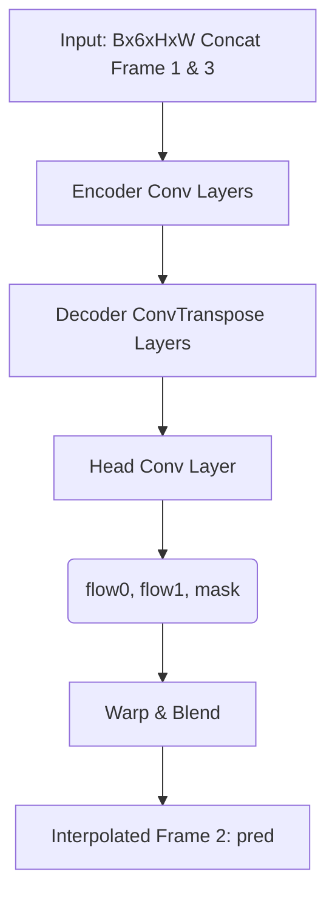

# 1. Repository Overview

- **High-level architecture**: A PyTorch-based repository designed for training a video frame interpolation model (flow-based). It includes custom PyTorch dataset classes, preprocessing scripts, and a full training loop with mixed precision.
- **Directory structure**:
  - `models/`: Contains the core model definitions (`basic_flow.py`).
  - `splits/`: Text files defining train/validation dataset splits.
  - `src/` & `tests/`: Pre-existing desktop video processing engine components (VideoReader, FrameExtractor, etc.).
- **Purpose of each major directory**:
  - `models/`: Centralizes the neural network architectures.
  - `splits/`: Manages dataset splitting configurations.
- **Important entry points**:
  - `train.py`: Main script for model training and validation.
  - `preprocess.py`: Resizes the dataset frames.
  - `visualize_train.py`: Loads a trained checkpoint and validates outputs visually.

---

# 2. Model Architecture

- **Model name**: `BasicFlowInterp`
- **File location**: `models/basic_flow.py`
- **Architecture summary**: A lightweight encoder-decoder structure that predicts optical flow fields and a blending mask for a pair of input frames. It wraps `F.grid_sample` to warp the original frames according to the predicted flow fields and then blends them together using the predicted mask.
- **Input tensors**: A single tensor of shape `(Batch, 6, Height, Width)`.
- **Output tensors**: Returns a Python dictionary containing multiple tensors.
- **Internal outputs**:
  - `flow0`: Optical flow field for the first frame `(B, 2, H, W)`.
  - `flow1`: Optical flow field for the second frame `(B, 2, H, W)`.
  - `mask`: The blending mask `(B, 1, H, W)`.
- **Intended for deployment**: The `pred` tensor from the dictionary `(B, 3, H, W)`.

### Architecture Diagram



---

# 3. Dataset Pipeline

- **Dataset used**: Vimeo Triplet Dataset.
- **Folder structure**: The root directory contains a `sequences/` folder, which contains individual subfolders for each sequence (e.g., each sequence has `im1.png`, `im2.png`, `im3.png`).
- **Preprocessing**: `preprocess.py` utilizes PIL to convert images to RGB and resizes them to 448x256 using Lanczos resampling.
- **Augmentation**: None is applied in the `dataset.py` pipeline (only `torchvision.transforms.ToTensor()` is used).
- **Train/Validation/Test split**: Managed via standard `.txt` files (`train_list.txt` and `val_list.txt`) that list sequence names.
- **Tensor shapes**: Loaded frames are `(3, H, W)`.
- **Input/output format**:
  - **Two frames become one**: The dataloader explicitly concatenates `im1` and `im3` along the channel dimension using `torch.cat([im1, im3], dim=0)`. This transforms two `(3, H, W)` frames into a single `(6, H, W)` input tensor `x`.
  - The target ground truth tensor `y` is simply `im2`.

---

# 4. Training Pipeline

- **Training script**: `train.py`
- **Loss functions**: `nn.L1Loss()`
- **Optimizer**: Adam (Learning Rate: `1e-4`).
- **Scheduler**: None implemented.
- **Mixed Precision**: Uses `torch.amp.autocast('cuda')` and `torch.amp.GradScaler` for faster CUDA training.
- **Checkpointing**: Checkpoints are saved per epoch as `checkpoints/checkpoint_epoch_{epoch}.pth`, with the best loss model continually overriding `checkpoints/best_model.pth`.
- **Logging**: Training logs are written directly to a CSV file (`outputs/training_log.csv`) and printed to the console using `tqdm`.
- **Validation**: Performed dynamically at the end of each epoch over the validation dataloader.
- **Metrics**: Validates using L1 Loss, PSNR, and SSIM (using `torchmetrics.image.StructuralSimilarityIndexMeasure`).

---

# 5. Checkpoints

- **Checkpoint directory**: `checkpoints/`
- **Available checkpoints**: Code produces `checkpoint_epoch_{X}.pth` and `best_model.pth`.
- **Deployable checkpoint**: **None are currently deployable as raw weights.**
- **Clarification**: The saved `.pth` files are *training checkpoints*. They contain a dictionary wrapping the model state alongside optimizer states, scaler states, the current epoch, and various loss metrics. A true deployment weight file should strictly contain the stripped `model.state_dict()` to minimize footprint.

---

# 6. Export Pipeline

**ONNX export does NOT exist.** There is no export or conversion code present in the repository.

---

# 7. Inference Pipeline

**No inference wrapper exists.**

While `visualize_train.py` loads the model and runs predictions, it functions strictly as an evaluation script tied to the `VimeoTripletDataset`. It explicitly demands ground truth frames (`y`) to run and dumps samples via `torchvision.utils.save_image`. There is no generic `predict()`, `infer()`, or standalone function that takes arbitrary in-memory numpy arrays and yields a result.

---

# 8. Input Contract

- **Color order**: RGB (forced during `dataset.py` load via `convert("RGB")`).
- **Datatype**: `float32` (cast by `ToTensor()`).
- **Normalization**: `[0, 1]` range.
- **Tensor shape**:
  - **External expected input**: Two individual RGB frames.
  - **Internal tensor layout**: Concat `(Batch, 6, Height, Width)`. Channels 0-2 must be frame 1; Channels 3-5 must be frame 3.
  - **Batch dimension**: Yes, index 0.
  - **Resolution requirements**: Trained at fixed 448x256 dimensions. However, because the encoder-decoder is entirely convolutional and the flow generator creates a dynamic mesh grid relative to `H` and `W`, the architecture relies on **dynamic resolution**.

---

# 9. Output Contract

- **Output datatype**: `float32`
- **Output color format**: RGB
- **Tensor shape**: `(Batch, 3, Height, Width)`
- **Range**: Approximately `[0, 1]`.
- **Downstream consumption**: Applications should explicitly consume the tensor housed in the `"pred"` key of the output dictionary.

---

# 10. Runtime Dependencies

- **Training**: `torch`, `torchmetrics`, `tqdm`, `Pillow`
- **Inference**: `torch`

---

# 11. Public API

Currently, the only API exposed for downstream usage is the raw PyTorch module:

```python
from models.basic_flow import BasicFlowInterp

class BasicFlowInterp(torch.nn.Module):
    def forward(self, x: torch.Tensor) -> dict: ...
```

---

# 12. Configuration

There are no generic `.yaml` or `.json` config files. Configuration is handled entirely via global constants injected at the top of the execution scripts:

- **train.py**: Hardcodes `PREPROCESSED_ROOT`, `TRAIN_LIST`, `VAL_LIST`, `BATCH_SIZE`, `EPOCHS`, `LR`, and `NUM_WORKERS`.
- **preprocess.py**: Hardcodes `TARGET_SIZE` and dataset root folders.
- **visualize_train.py**: Hardcodes `CHECKPOINT`, `NUM_SAMPLES`, and `OUT_DIR`.

---

# 13. Deployment Readiness

**Can this repository already be integrated into another application?**
**No.**

**Exactly what is still missing?**
- An ONNX or TorchScript export script.
- A script to strip optimizer state dictionaries and save pure deployment weights.
- An abstracted `InferenceEngine` wrapper. 

---

# 14. Integration Recommendations

Since the existing pipeline (`VideoReader` -> `FrameExtractor` -> `ProcessingPipeline` -> `VideoWriter`) operates on OpenCV BGR numpy arrays, the following ownership strategies are recommended for integration:

- **Inference Ownership**: A standalone `InferenceEngine` class must be written to encapsulate the ONNX runtime or PyTorch model. The `ProcessingPipeline._process_pair(left, right)` method will simply hand arrays to this wrapper.
- **Preprocessing Ownership**: The `InferenceEngine` should accept standard BGR numpy arrays. The engine wrapper itself should be responsible for converting BGR to RGB, scaling `[0, 255]` to `float32 [0, 1]`, permuting to `(C, H, W)`, applying the batch dimension, and concatenating the frames into the `(B, 6, H, W)` tensor.
- **Postprocessing Ownership**: The `InferenceEngine` should extract the `pred` tensor from the output dictionary, un-batch it, un-normalize it back to `[0, 255] uint8`, and convert it from RGB to BGR before returning it to the `ProcessingPipeline`.
- **Resizing Ownership**: The `ProcessingPipeline` should defer resizing. Given that the neural architecture appears resolution-agnostic, we should attempt pass-through dynamic shapes first, scaling down only if memory constraints demand it.

---

# 15. Missing Deliverables

- [ ] `export.py` (ONNX/TorchScript exporter)
- [ ] `extract_weights.py` (Strips optimizer states from training checkpoints)
- [ ] `InferenceEngine` wrapper class
- [ ] `requirements.txt` isolating training vs. inference dependencies
- [ ] Interface documentation dictating exactly how `InferenceEngine` handles memory transfers
