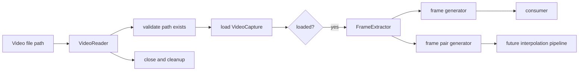

# Phase 2 Design Proposal - Frame Extraction

## Overview

Phase 2 adds frame extraction only. The goal is to extend the Phase 1 `VideoReader` into a streaming frame source that can yield individual frames and frame pairs without loading the full video into memory.

This design is intentionally narrow. It does not include FFmpeg, ONNX Runtime, AI inference, video reconstruction, audio handling, or any Phase 3+ pipeline work.

## SECTION 1: Directory Changes

Planned structure:

- `src/video_engine/`
  - `__init__.py`
  - `logger.py`
  - `video_reader.py`
  - `frame_extractor.py`
- `tests/`
  - `test_video_reader.py`
  - `test_frame_extractor.py`
- `assets/sample_videos/`
  - `sample_video.avi`

Notes:

- Phase 1 files remain in place.
- Frame extraction logic is isolated in a new module to keep the reader focused on loading, metadata, and capture ownership.
- The sample video stays in `assets/sample_videos/` so both reader and extractor tests can reuse it.

## SECTION 2: New Files to Create

1. `src/video_engine/frame_extractor.py`
2. `tests/test_frame_extractor.py`

Potential future follow-up, if needed later, but not required for Phase 2:

- `src/video_engine/frame_types.py` if typed aliases become useful for clarity.

## SECTION 3: Class Definitions

### `FrameExtractor`

Role:

- Own frame iteration behavior.
- Receive a loaded `VideoReader` instance.
- Provide streaming access to frames and frame pairs.

Responsibilities:

- Validate that the supplied reader is already loaded.
- Expose generators for single frames and adjacent frame pairs.
- Never own, open, or close `VideoCapture` directly.

### Relationship to `VideoReader`

- `VideoReader` remains the low-level loader, metadata provider, and sole owner of `VideoCapture`.
- `FrameExtractor` consumes a loaded `VideoReader` instance rather than duplicating loading logic.
- This preserves Phase 1 behavior and keeps frame extraction separate from metadata concerns.

## SECTION 4: Method Signatures

Proposed public API:

```python
class FrameExtractor:
  def __init__(self, video_reader: VideoReader) -> None: ...
  def frame_generator(self) -> Iterator[numpy.ndarray]: ...
  def frame_pair_generator(self) -> Iterator[tuple[numpy.ndarray, numpy.ndarray]]: ...
```

Supporting behavior:

- `VideoReader.load_video()` remains responsible for path validation and opening the video.
- `FrameExtractor` should raise `RuntimeError` if initialized with a reader that is not loaded.
- `frame_generator()` and `frame_pair_generator()` should raise `RuntimeError` if called before loading.
- The generator methods should not cache all frames in memory.

Optional internal helpers, if needed:

- `_ensure_loaded() -> None`
- `_read_next_frame() -> tuple[bool, numpy.ndarray | None]`

## SECTION 5: Generator Design

### A. `frame_generator()`

Purpose:

- Yield one decoded frame at a time.

Expected flow:

1. Confirm the supplied `VideoReader` is loaded.
2. Read the next frame from the reader's active `VideoCapture`.
3. Yield the frame if reading succeeds.
4. Stop when no more frames are available.

Characteristics:

- Streaming only.
- No full-video buffering.
- Suitable for future consumers that process one frame at a time.

### B. `frame_pair_generator()`

Purpose:

- Yield overlapping adjacent frame pairs for future interpolation.

Expected flow:

1. Confirm the supplied `VideoReader` is loaded.
2. Read the first frame and hold it as `previous_frame`.
3. Read the next frame as `current_frame`.
4. Yield `(previous_frame, current_frame)`.
5. Shift `current_frame` into `previous_frame`.
6. Continue until the video ends.

Example output:

- `(frame1, frame2)`
- `(frame2, frame3)`
- `(frame3, frame4)`

Why this matters:

- Phase 7 interpolation will need neighboring frames.
- This design avoids retrofitting a second pass or large in-memory list later.

### Data Flow Diagram



## SECTION 6: Test Plan

Planned tests for `tests/test_frame_extractor.py`:

1. Sample video exists at `assets/sample_videos/sample_video.avi`.
2. A loaded `VideoReader` can be passed into `FrameExtractor`.
3. `frame_generator()` yields at least one frame.
4. The number of yielded frames matches the metadata frame count.
5. `frame_pair_generator()` yields overlapping adjacent pairs.
6. `frame_generator()` raises `RuntimeError` before iteration when the reader is not loaded.
7. `frame_pair_generator()` raises `RuntimeError` before iteration when the reader is not loaded.
8. Early generator termination releases resources cleanly.
9. Invalid reader state is rejected before extraction begins.
10. Resources are released after each test using fixtures.

Test style:

- Use `pytest`.
- Keep tests focused on behavior rather than implementation internals.
- Reuse the same sample video fixture as Phase 1.
- Keep cleanup assertions explicit so generator teardown is exercised.

## SECTION 7: Potential Risks

1. OpenCV frame decoding may expose codec-specific behavior on different systems.
2. Some videos can report metadata that differs slightly from decoded frame counts depending on encoding.
3. Generator cleanup must be careful to release `VideoCapture` even when iteration stops early.
4. Reusing the existing Phase 1 reader too aggressively could blur responsibilities, so the extractor should stay focused on frame iteration only.
5. Future interpolation work may require color-space or tensor conversion, but that should remain out of Phase 2.

## SECTION 8: Recommended Implementation Order

1. Create `src/video_engine/frame_extractor.py` with the streaming API skeleton.
2. Reuse Phase 1 loading and cleanup patterns.
3. Implement `frame_generator()` first, because it is the simplest streaming primitive.
4. Implement `frame_pair_generator()` next, using the single-frame stream pattern.
5. Add failure-path tests before writing detailed success-path assertions.
6. Add cleanup-focused fixtures to ensure OpenCV handles close reliably.
7. Run the new tests against the shared sample video.
8. Confirm Phase 1 tests still pass unchanged.

## Future Compatibility Notes

### Phase 3 - Video Reconstruction

- Frame extraction should produce frames in a form that can later be written back to video.
- The extractor should not mutate frame content or impose reconstruction-specific formatting.
- Keeping the API streaming-friendly makes it easy for a future writer to consume extracted frames in order.

### Phase 5 - Processing Pipeline

- A generator-based extractor can feed a pipeline stage without preloading the full video.
- The frame pair generator can later become the natural input for pipeline steps that compare or interpolate neighbors.
- This reduces the need for temporary frame caches.

### Phase 6 - ONNX Integration

- ONNX inference will eventually need frame data as a per-frame or per-pair input stream.
- The Phase 2 API should stay close to raw video decoding so the later inference layer can decide how to convert frames.

### Phase 7 - Full Video Inference

- Full inference will combine extraction, interpolation, and reconstruction.
- The Phase 2 generators provide the upstream data source needed for that end-to-end flow.
- The pair generator is especially important because future interpolation will likely consume adjacent frame pairs.

## SECTION 9: Phase 2 Implementation Plan

1. Update or add tests first for the new ownership model and generator-only scope.
2. Introduce `FrameExtractor` so it accepts a loaded `VideoReader` instance.
3. Implement `frame_generator()` using streaming reads from the existing capture owned by `VideoReader`.
4. Implement `frame_pair_generator()` by reusing the same streaming read path with a one-frame lookback.
5. Add resource-cleanup handling for early generator termination.
6. Run the extractor tests and confirm Phase 1 tests still pass unchanged.
7. Verify the implementation remains strictly limited to frame extraction and does not introduce reconstruction or inference code.

## Decision Summary

The preferred design is a small `FrameExtractor` module that keeps streaming behavior explicit and memory usage low. It should accept a loaded `VideoReader`, expose only single-frame and adjacent-pair generators, reuse the established Phase 1 resource handling patterns, and stay isolated from all later pipeline concerns.
